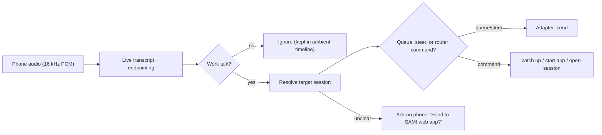

# Voice router: from live speech to a routed prompt

The router sits between the live transcript and the agent adapters
([harness-integration.md](harness-integration.md)).

## Pipeline

### 1. Live transcript and endpointing

Today, audio streamed from the phone is only transcribed after the clip closes
(`core/mobile/ingest.rs::finish_stream_clip`). Stream mode needs:

- **Partial words while speaking.** Reuse the dictation helper's
  trailing-window re-transcription (`native-pkg/.../mic_partials.swift`).
- **Utterance boundaries.** Silero VAD (the CoreML model is already downloaded
  in `~/Library/Application Support/FluidAudio/Models`) plus a pause threshold
  (about 700–900 ms) closes an utterance.
- **Hold-back window.** Don't send the instant a pause is detected. Wait about
  1.5 s so "…and also make it sticky" can merge into the same prompt before
  it's routed.
- **Explicit end words.** Optional: "send it" or "go" sends immediately.

### 2. Work-talk gate

Drop background conversation, personal talk, TV and filler. Dropped speech is
not lost: it still lands in SOURCE's ambient lane like any other transcript.

Signals, cheapest first:

1. **Voice match.** Is it the paired user's voice? FluidAudio ships a speaker
   diarizer that SOURCE doesn't use yet.
2. **Addressing.** Imperative verbs, project or app names, UI words.
3. **The model's call.**

### 3. Target resolution

Pick the target in this order:

1. **An explicit name** ("the SAMI web app", "the Mac app", "the PCB").
2. **The session open on the phone.**
3. **The last target, if the topic fits.**
4. **Otherwise ask.**

Context the router is given:

- The session list: app, title, project folder, one-line "about".
- Busy or idle state per session.
- What the phone is showing.
- The last target.

Later: a per-project glossary built from AGENTS.md, README headings and recent
session titles, so words like "watchlist" or "pairing screen" map to a
project.

### 4. Delivery mode

- **Queue** is the default.
- **Steer** only when the target is busy *and* the speaker corrects, cancels or
  adds to the last request: "I forgot…", "add this to the prompt I just sent",
  "actually stop", "no, I meant…".
  - A keyword rule should catch these before the model does. In the local test
    the model missed two of them.
- The correction phrase itself can stay in the prompt; agents handle it fine.

### 5. Router commands

| Command | Example | What happens |
|---|---|---|
| `catch_up` | "catch me up on the marketing site", "what did we do yesterday" | Summarise one session or all |
| `start_app` | "start the app so I can test it" | Run the project's dev command, send the URL to the phone |
| `open_session` | "open the SAMI session" | Switch the phone to that session |

### 6. Confidence and undo

- **Low confidence.** Show a one-tap confirm card on the phone; for voice-only
  use, speak it: "Send to SAMI web app?".
- **After sending.** Show a toast for 3–5 s with **Undo**. For queued prompts,
  undo removes the item from the queue (Codex `thread/queue/delete`, Factory
  queued-message resolve). For sent turns, undo = interrupt.

## P5: accuracy and latency test

**Setup.**

- 25 typed sentences that mimic streamed speech, against 6 sample sessions
  across all four apps.
- The mix: work prompts, steer corrections, background chatter, a TV line, an
  AI "hot take", filler, catch-up requests, start app, open session, and one
  deliberately vague "add OAuth".
- The model returns JSON: `action`, `target`, `delivery`, `meta`,
  `confidence`.
- Graded on action + target + delivery/meta.

**Results.**

| Router backend | Correct | Median | Worst | Notes |
|---|---|---|---|---|
| OpenCode free cloud model `muse-spark-1.3-contributor-free` | 25/25 | 4.9 s | 53.9 s | Free, needs internet; long stalls on some requests |
| Local `Qwen3-4B-Instruct-2507-4bit` (MLX), first try | 16/25 | 7.5 s | 14.5 s | Offline; mixed up the JSON fields ("steer" as an action) |
| Same local model, shared prompt prefix cached + tighter rules | 21/25 | 2.3 s | 2.7 s | Offline, free, ~2.1 GB model on disk |

**Local misses** (last run):

- Two steer corrections were queued instead ("oh wait I forgot…", "no no, I
  meant monthly").
- One explicit "SAMI web app" instruction got "ask" instead of "send".
- Once it wrote `"null"` as text instead of an empty value.

**Caveats.** These numbers are optimistic:

- I wrote the sentences and their expected answers.
- The local rules were tightened after seeing the first local run.
- Real streamed speech has transcription errors and half-finished sentences.

Treat this as "it's feasible" rather than as the accuracy to expect.

**Takeaways.**

- Routing is feasible for free on the Mac. The shape that works: a warm
  local model with the rules and session list prefilled once, a short JSON
  answer, and keyword rules for steer.
- Keep a cloud model as an optional second opinion when confidence is low. A
  subscription agent in headless mode can also do heavy "catch me up"
  summaries, where a few seconds doesn't matter.
- Memory on the 16 GB M2: the 4B model is about 2.1 GB, next to Parakeet and
  Kokoro. That leaves room, but bigger (9B+) models would crowd the machine.

## Catch me up

`catch_up` reads transcripts directly rather than asking each agent, which
would cost quota and pollute its context:

| App | Source |
|---|---|
| Codex | `thread/turns/list` |
| Claude | `~/.claude/projects/**.jsonl` |
| Factory | `~/.factory/sessions/**.jsonl` |
| OpenCode | `GET /api/session/:id/context` |

SOURCE keeps a rolling per-session summary: updated when a turn completes, and
stored next to the session index. Then:

- "Catch me up on X" reads one summary.
- "Catch me up on everything" merges summaries ordered by last activity, which
  also answers "which app did I last use for the marketing site?".
- Summaries come from the local model when short; a subscription agent in
  headless mode handles long histories.
