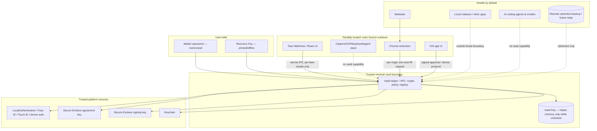

# O / Source Credential Vault — Security Architecture

**Status:** v0.3, with v0.4 alignment notes (2026-09-24) — owner decisions incorporated; canonical security reference. The Phase F backup/sync design it constrains is specified in `credential-vault-implementation-spec.md` v0.4 (§11).  
**Supersedes:** Proposal v0.2 and the unresolved decisions in `o-source-credential-vault-threat-model-v0.1.md`  
**Phase:** Phases A–E and E.1 implemented and verified; Phase F specified (spec v0.4) but not authorized or started. No real credentials may be imported and no credential-vault implementation is authorized merely by this document.  
**Author basis:** Adversarial review of the v0.1 threat model against the actual O/Source repository, plus owner UX/security decisions made on 2026-09-17.

---

## 1. Executive summary

The v0.1 threat model was directionally sound: local-first, Rust-centric,
narrow command surfaces, no provider-held decryption capability, and explicit
AI isolation. The repository review found that Source itself is the dominant
risk because it already has Screen Recording, Accessibility/Input Monitoring,
OCR, keyboard capture, agent control surfaces, a WebView, a network server,
and a large native dependency graph.

This v0.3 incorporates the owner's product decisions and tightens four areas
that remained too optimistic in v0.2: recovery-key revocation, device-key
separation, AI-agent guarantees, and process isolation.

The architecture is now:

- **Direct device-to-device sync is preferred for normal operation.** Mac and
  iPhone exchange encrypted vault state over the existing pinned device
  channel when available. *(v0.4 sequencing note: implemented in Phase
  F.2; Phase F first delivers provider-mediated Mac sync and iPhone
  envelope catch-up — spec v0.4 §11, §18.)*
- **A durable remote ciphertext backup is part of the recovery architecture.**
  It stores only encrypted vault state and the minimum metadata required to
  retrieve it. It never receives plaintext, the Vault Key, the master
  password, the Recovery Key, or device private keys. The initial backend can
  be a simple object/relay service; decentralized storage is a future option,
  not a v1 requirement.
- **A random 256-bit Vault Key (VK)** encrypts vault records. It is wrapped
  independently for the master password, the offline Recovery Key, and
  enrolled devices. Either the master password **or** the Recovery Key can
  recover a remotely backed-up vault; neither is sent to the backup service.
- **Each device has two separate cryptographic roles:** a signing key and a
  key-agreement key. On Apple platforms both should use P-256 and Secure
  Enclave backing where platform APIs permit. One key is not reused for both
  purposes.
- **The vault core is isolated from the main Source process before real
  credentials are used.** On macOS this means a minimal hardened helper/XPC
  process (or equivalently strong process boundary) owns VK and plaintext
  operations. The main Tauri/WebView/capture/agent process is not trusted with
  bulk secret access.
- **Credential release is one-action-at-a-time.** Normal UX is a quick user
  presence check: Touch ID when available, Face ID approval on an enrolled
  iPhone when using the Mac in clamshell mode, or native macOS login
  authentication when the phone/Touch ID path is unavailable. The long Source
  master password is reserved primarily for recovery, setup, and exceptional
  fallback rather than every website login.
- **An iPhone approval is a signed, one-time authorization, not a password
  transfer.** The request is bound to the requesting Mac, action, origin,
  nonce, and expiry. The phone signs only after Face ID/passcode user presence.
  The Mac verifies the enrolled phone's signature. The implementation must
  account honestly for iOS background-wake limitations; reliable lock-screen
  notification delivery may require APNs or another wake mechanism, but no
  secret material is sent through that service.
- **Every device revocation rotates VK automatically.** There is no
  "theft-only" branch.
- **Recovery-Key replacement also rotates VK.** Merely re-wrapping the same VK
  would leave a stolen old RK capable of decrypting current data if the
  attacker retained an older recovery wrap. Historical ciphertext already
  copied by an attacker cannot be retroactively erased; that limitation is
  explicit.
- **Chrome/Chromium is the v1 desktop autofill target.** Safari and Firefox are
  backlog items.
- **Payment cards may store number, expiry, cardholder, and billing address,
  but not CVV.** Every card fill requires fresh user presence.
- **Source ID is a future authorizer/recovery signal, not the vault's
  cryptographic root.** v1 keeps Source ID and vault root keys separate while
  leaving an integration point for Source ID to approve actions or recovery
  later.
- **Password-field capture suppression is required independently of the
  vault.** Source's global keyboard recorder must suppress secure/password
  input contexts. Vault and import surfaces are excluded from screen capture,
  OCR, indexing, and keyboard capture.
- **FileVault is strongly recommended, not a hard product gate.** Source Vault
  remains independently encrypted. If FileVault is off, the product warns
  that the rest of the Mac and Source's non-vault capture data have weaker
  at-rest protection.
- **This document is the canonical security reference.** The earlier threat
  model remains historical input; if the two conflict, this v0.3 controls.

No real Dashlane export or production credential may be used until the release
gates in §§20–21 are satisfied.

## 1A. Product UX snapshot

The intended v1 experience is deliberately simple:

- **Mac open:** website asks for login → Source offers account → Touch ID →
  filled.
- **Mac clamshell + iPhone nearby:** website asks for login → Source offers
  account → "Approve on iPhone" → Face ID on iPhone → filled.
- **Mac clamshell + no iPhone:** website asks for login → native macOS
  authentication prompt → Mac login password → filled.
- **Both devices lost:** obtain a new supported device → download encrypted
  backup → enter either MP or printed RK → recover locally.
- **Card purchase:** authorize with Face ID/Touch ID/macOS auth → card number
  fills → user types CVV manually.

This UX is a requirement, not just an illustration. Security mechanisms should
be evaluated partly by whether they preserve this low-friction behavior.

---

## 2. Findings from reviewing the original threat model

### 2.1 Missing attack surfaces

**F1. Source's own capture pipeline is the top threat.**
The app records the screen (ScreenCaptureKit), OCRs frames into full-text
search (`core/ocr_processor.rs`, `core/search_engine.rs`), records keyboard
events (`core/keyboard_recorder.rs`), and keeps video, transcripts, and a PII
review queue in a plaintext SQLite database at `~/.observer_data/database/
observer.db`. Consequences:

- Credentials typed into *any* app are already captured as keyboard events
  today (pre-existing risk; the PII review feature exists precisely because
  of this class of leak).
- A vault UI rendered in Source's own WebView would be screen-recorded and
  OCR'd by Source itself unless explicitly excluded.
- The Dashlane CSV export, if ever opened on screen, would be recorded and
  OCR'd.

The threat model's Scenario 12 (logs/telemetry) is the tip of this iceberg.
Capture exclusion must be a first-class control and a release gate.

**F2. Source holds extraordinary OS permissions.**
The app requires Screen Recording and Accessibility/Input Monitoring TCC
grants. Compromise of the Source binary, its update path, or any dependency
inside it is equivalent to a purpose-built credential stealer with
persistence. This raises the supply-chain bar above what the threat model
describes and motivates the hardening prerequisites in §3 and §15.

**F3. The existing phone channel can drive coding agents.**
`/v1/agent` (see `core/mobile/agent_socket.rs`) lets a paired phone send
prompts to Claude Code / Codex / Factory / OpenCode on the Mac. If the vault
shipped inside the same authorization domain, a stolen phone token would sit
one WebSocket away from both the agents and the vault. Vault operations need
a separate authorization scope; the pairing model itself must be upgraded
(F5).

**F4. The WebView's current effective permissions are broad.**
`tauri.conf.json` sets `csp: null`, enables `macosPrivateApi`, and scopes
the asset protocol to `$HOME/**`. Any XSS in the frontend today is close to
arbitrary file read *as the user*, including `~/.observer_data/` — which
will include vault ciphertext and the mobile TLS private key. The threat
model assumes "strict Tauri CSP" as an existing control; it is absent.

**F5. Existing mobile pairing is bearer-token based.**
`core/mobile/pairing.rs` issues 48-char tokens, stores SHA-256(token) in
SQLite (good), but tokens never expire, carry full scope, and `/v1/stream`
accepts the token in the URL query string (`server.rs::bearer_device`),
where it can land in proxies and logs — `/v1/agent` deliberately refuses
query auth for this reason (decision D11). Adequate for voice clips;
insufficient as the identity layer for a vault. The vault requires
per-device asymmetric keys and challenge-response auth (§8).

**F6. Rollback, replay, and equivocation are under-designed.**
The threat model says "test rollback/replay" but designs nothing. Without a
signed, monotonically versioned vault manifest and a signature-chained
device registry, any sync channel (server or rogue peer) can silently roll a
device back to an old vault (reviving deleted credentials, resurrecting
revoked devices) or fork two devices into divergent views. §11 specifies
the mechanism.

**F7. Homoglyph / IDN phishing is unaddressed.**
"No substring matching" is not a phishing policy. Punycode lookalikes
(`xn--...`), confusable Unicode, and deceptive subdomains
(`github.com.evil.example`) each need explicit handling (§12).

**F8. Real-domain adversary-in-the-middle phishing defeats origin binding.**
Evilginx-style reverse proxies present the *real* origin; autofill will
correctly fill, and the attacker harvests the session token. Password
autofill cannot solve this; passkeys do. Must be documented as a known
limitation, not silently implied away by "phishing resistance."

**F9. Dashlane export realities.**
CSV export does not cover all item types (passkeys and some ID/note types
are excluded or malformed across versions), quoting has historically been
inconsistent (parser fuzzing is justified), and the exported file will be
Spotlight-indexed and may land in an iCloud-synced `~/Downloads`. §13
accounts for this.

**F10. No process isolation exists today.**
The threat model's "trusted Rust security core" currently shares a process and
address space with FFmpeg C bindings, Tesseract, Leptonica, an axum network
server, and ~500 crates. A memory-corruption bug anywhere in that set could
reach VK. v0.3 therefore moves a separate minimal vault helper/XPC boundary
into the pre-real-credential v1 release gate (§§5, 15, 22), rather than
treating it as optional later hardening.

### 2.2 Incorrect or confused assumptions

**F11. "Keychain / Secure Enclave" is conflated.**
The Secure Enclave stores only non-exportable P-256 EC keys (signing and
ECDH); it does not store arbitrary symmetric keys or wrapped blobs. The
workable pattern is: device *identity* keys in the Secure Enclave where
available; *key unwrapping material* in the Keychain as generic-password
items with `kSecAttrAccessibleWhenUnlockedThisDeviceOnly` plus a
`SecAccessControl` requiring user presence. §6 and §15 use this model.

**F12. "Remote revocation" over-promises.**
No revocation mechanism can reach secrets already decrypted on an unlocked
device, and an offline stolen device cannot be forced to erase its old local
snapshot. The new remote ciphertext backup does not change that: it is storage,
not a remote-wipe authority. v0.3 defines revocation as denying future
authorized use/sync **plus automatic VK rotation**, so the revoked device
cannot decrypt new current states when it later reconnects (§9).

**F13. Whole-device encryption and vault encryption are separate layers.**
FileVault materially improves offline-theft protection for the broader Mac and
Source's non-vault data, but Source Vault must remain independently encrypted.
v0.3 treats FileVault as a strong recommendation with an explicit warning when
off, not as a hard gate. Keychain/SE access controls and the independent MP/RK
wraps remain part of the vault design (§15).

**F14. Clipboard controls cannot be guaranteed on macOS.**
Any process can read the general pasteboard without permission; Universal
Clipboard propagates copied items to iCloud and other devices; "clear after
N seconds" is a convention honored only by cooperating apps. The concealed
pasteboard type (`org.nspasteboard.ConcealedType`) suppresses clipboard
managers and Universal Clipboard and must be used, but the honest control is:
prefer autofill, treat copy as a high-risk action with re-authentication.

**F15. "Zero-knowledge sync" still leaks metadata.**
Even a ciphertext-only relay sees record counts, ciphertext sizes, write
timing, device identifiers, and IP addresses. The invariant is restated as:
*the server learns no plaintext secrets and no decryption capability* — not
"learns nothing."

**F16. Terminology: Source has no vault server today.**
The current product has only the LAN/Tailscale-style mobile bridge. v0.3 still
prefers direct peer sync, but disaster recovery requires a durable remote
ciphertext backup. That backup is an untrusted storage/availability component,
not a decryption or device-authorization authority (§11).

**F17. Supply-chain prerequisites are missing.**
`Cargo.lock` is in `.gitignore`. For a security product this must change:
reproducible dependency resolution is the baseline that `cargo audit` /
`cargo vet` build on. Also noted: heavy native dependencies
(ffmpeg-sys-next, tesseract, leptonica-sys) compile and link C into the
trusted process (see F10).

### 2.3 What survives review intact

- Zero-knowledge-by-design sync; keys never leave devices in unwrapped form.
- Random vault key wrapped by password-derived key (not per-record password
  encryption).
- No AI-facing secret APIs; synthetic fixtures only; no real Dashlane export
  in any AI-readable location.
- Origin-bound, fail-closed autofill; no generic `getAllSecrets()`.
- Memory-hard KDF; no custom primitives; established libraries only.
- V1 exclusions (passkeys, sharing, teams) — correct scoping.
- The four-decision gate before any implementation spec — correct process.

---

## 3. Corrections/additions to the threat model

These changes supersede conflicting statements in v0.1/v0.2.

| # | Change | Section |
|---|---|---|
| C1 | Source's own screen/OCR/keyboard/audio capture is the top threat; vault/import surfaces must be excluded before real credentials. | §§7, 15, 20, 21 |
| C2 | Platform hardening is prerequisite work: strict CSP, narrow asset scope, hardened runtime/library validation, committed `Cargo.lock`, dependency audit/vet. | §§15, 20–22 |
| C3 | Vault authorization is separate from legacy mobile bearer tokens and `/v1/agent`; vault devices use asymmetric challenge-response. | §8 |
| C4 | Add signed monotonic manifests and signature-chained device registry for rollback/replay/fork detection. | §11 |
| C5 | Autofill explicitly handles IDN/punycode, confusables, iframes, subdomains, HTTP downgrade, and real-domain AitM limitations. | §12 |
| C6 | Revocation means denying future use/sync plus automatic VK rotation; it never retroactively protects secrets already exposed. | §9 |
| C7 | Clipboard controls are mitigation only; prefer direct fill and gate copy/reveal. | §§12, 15, 17 |
| C8 | Normal sync prefers direct peer-to-peer, but durable remote ciphertext backup is required so disaster recovery has something to restore. The backup is not trusted and cannot authorize. **v0.4 note:** Phase F implements the provider-mediated multi-writer protocol and tests it with simulated Mac devices; a product vault in Phase F has one Mac writer, because Mac-to-Mac enrollment is not yet specified (adding a second physical Mac awaits an owner decision). Direct Mac⇄iPhone peer sync and the iPhone vault client follow in Phase F.2. The provider still cannot authorize anything: it authenticates requests with device and recovery public keys and enforces structure, but clients verify every accepted state themselves. | §11 |
| C9 | Keychain and Secure Enclave roles are distinct; SE holds asymmetric keys, Keychain holds protected wrapped material/metadata. | §§6, 15, 16 |
| C10 | FileVault is a strong recommendation rather than a hard vault-creation gate. Source Vault must remain independently secure at rest. | §§15, 17, 19 |
| C11 | Recovery is fully specified: either master password or RK can recover the current backed-up vault; Source has neither. | §10 |
| C12 | A stolen/replaced RK is revoked by generating a new RK **and rotating VK**. Old RK + old ciphertext may still expose historical snapshots; no design may claim otherwise. | §10 |
| C13 | Source ID is deferred as a recovery/authorization factor. v1 keeps vault root keys cryptographically independent while reserving an integration boundary. | §§10, 19 |
| C14 | Each device uses separate signing and agreement keys. Apple v1 should prefer two P-256 Secure-Enclave-backed keys rather than mixing X25519/P-256 without need. | §§6, 8, 18 |
| C15 | The main Source process is not an acceptable long-term home for VK. A minimal vault helper/XPC process becomes a **pre-real-credential v1 gate**, not a post-v1 hardening milestone. | §§5, 14, 15, 20–22 |
| C16 | AI isolation claims are bounded honestly: no product API exposes bulk secrets, but an autonomous agent with same-user OS control is not magically contained by API design. Production-vault use therefore requires process/path separation and operational discipline. | §§14, 17 |
| C17 | Normal credential release is low-friction, one action at a time: local Touch ID/Face ID, enrolled-iPhone signed approval, or native macOS login authentication fallback. | §§6, 15, 16 |
| C18 | All device revocations rotate VK automatically. | §9 |
| C19 | Chrome/Chromium is v1 desktop autofill; other browsers are backlog. | §12 |
| C20 | Store payment-card number/expiry/name/billing address if desired; do not store CVV; card fill always requires fresh user presence. | §§12, 19 |
| C21 | Password-field detection/suppression becomes a parallel Source hardening work item independent of vault UI. | §§15, 20–22 |
| C22 | This security architecture v0.3 is the canonical security reference; do not maintain two divergent normative documents. | §19 |

## 4. Existing O/Source architecture relevant to this work

From direct inspection of this repository (2026-09-17):

**Application shape.** Tauri 2.x desktop app (`com.racker.zero`), React 19 +
Vite frontend, Rust backend. ~110 Tauri commands registered in
`src-tauri/src/app/run.rs`. App is a menu-bar resident: closing the window
hides it; it does not quit. (Consequence: vault auto-lock cannot rely on
window close or app exit.)

**Persistence.** Plaintext SQLite via sqlx at
`~/.observer_data/database/observer.db`; media and derived data under
`~/.observer_data/`. No encryption at rest anywhere today. Migrations via
`sqlx::migrate!`.

**Capture stack.** ScreenCaptureKit video + OCR (Tesseract) + full-text
search; keyboard and mouse event recording; microphone capture, ASR,
emotion/sound classification; gaze tracking. PII detection/redaction exists
(`core/context_timeline/pii.rs`, `ocr_agent_context`) as a review UI — a
useful precedent, but not a guarantee, for vault-related redaction.

**Phone bridge (`core/mobile/`).** Axum HTTPS server on all interfaces,
self-signed cert persisted at `~/.observer_data/mobile/` (private key file
mode 0600), mDNS advertisement of the SHA-256 cert fingerprint. Pairing:
QR payload carries host/port/fingerprint/one-time secret
(`enrollment.rs`); camera-free fallback uses an Allow/Deny dialog plus a
4-character SAS derived from the TLS fingerprint (`pair_requests.rs`).
Auth: SHA-256-hashed bearer tokens in SQLite (`pairing.rs`); `/v1/agent`
requires header auth, `/v1/stream` also accepts query tokens. Away-from-home
via Tailscale is roadmap item M4 (decision D6: the pairing pins the cert
fingerprint and ignores hostname, so it survives Tailscale).

**Agent integration.** `core/agent_sessions` reads Claude/Codex/Factory/
OpenCode session transcripts; `core/agent_bridge` can drive those agents
(D12: SOURCE owns a `--resume` Claude process). The phone can steer agents
remotely when enabled (D11).

**Security-relevant config today.** `csp: null`; `macosPrivateApi: true`;
hardened runtime disabled; asset protocol scope `$HOME/**`; capabilities are
minimal and fine (`core:default`, opener, dialog — no shell/fs/clipboard
plugin permissions). No keychain, no AEAD, no KDF dependencies yet;
`sha2`, `rand`, `rcgen`, `base64`, `qrcode` are present. No outbound HTTP
client in the Rust tree (no reqwest/ureq) — the app currently makes no
cloud calls, which the vault design preserves.

**Identity.** No existing Source identity system. Mentions of "identity" in
the tree refer to speaker identity and Apple code-signing. The vault's
device registry will be the first cryptographic identity construct in the
codebase; a future Source identity root is an open question (§19), not an
existing constraint.

**iOS.** The iPhone app is a separate repository (referenced by
`docs/agentic-engineering/`); it already implements the Swift side of
fingerprint pinning and the SAS. Vault work will touch both repos.

**Implications.** The vault inherits: a proven QR-pairing UX, a pinned-TLS
device channel, mDNS discovery, and a disciplined module layout with a
350-line file cap. It must *not* inherit: bearer-token auth, `csp: null`,
the broad asset scope, or the assumption that being inside Source is a safe
place to show secrets.

---

## 5. Trust-boundary diagram



Boundary rules:

- The **main Source/Tauri process is not the vault core**. It is treated as
  partially trusted because it contains the WebView, capture stack, agent
  bridge, network services, and large dependency graph.
- Before real credentials are imported, plaintext vault operations and VK
  residency move behind a minimal hardened helper/XPC boundary on macOS.
- The WebView never receives a vault dump, bulk search over secret values, VK,
  master password, RK, or device private key.
- The Chrome extension receives only the credential approved for one verified
  origin and one fill transaction.
- The iPhone may approve an action by signing a short-lived challenge after
  user presence. The approval is authorization, not a transfer of the user's
  password or biometric template.
- Source's capture/agent subsystems have no vault authorization scope.
- The remote backup/relay is an untrusted storage/mailbox component. It may
  withhold, replay, reorder, or delete ciphertext; signatures/manifests detect
  integrity/freshness problems. It can never decrypt or enroll a device.
- No document may claim that API isolation alone makes secrets invisible to an
  AI agent that has already obtained arbitrary same-user OS control. The
  helper/process boundary and operational separation reduce that risk; a
  fully compromised OS remains out of scope.

## 6. Key hierarchy and authorization model

### 6.1 Key hierarchy

```text
                         ┌──────────────────────────────┐
                         │ Vault Key (VK)               │
                         │ 256-bit CSPRNG               │
                         │ never stored unwrapped       │
                         └──────────────┬───────────────┘
                  wrapped independently │
          ┌─────────────────────────────┼────────────────────────────┐
          │                             │                            │
          ▼                             ▼                            ▼
┌──────────────────┐         ┌──────────────────┐        ┌──────────────────────┐
│ Password wrap    │         │ Recovery wrap    │        │ Per-device envelope │
│ Argon2id(MP)→PK  │         │ machine-random RK│        │ sealed to device    │
│ PK wraps VK      │         │ RK wraps VK      │        │ agreement public key│
└──────────────────┘         └──────────────────┘        └──────────────────────┘

VK in use (HKDF-SHA-256 domain-separated subkeys):
  "record"  → record encryption
  "meta"    → metadata encryption
  "manifest"→ manifest/authentication material
  "recovery-epoch" → disaster-recovery state binding if required by spec
```

### 6.2 Core key roles

- **Vault Key (VK).** 256 bits from the OS CSPRNG at vault creation. It is the
  root symmetric secret for vault contents. It is stored only wrapped; when
  unlocked it exists only inside the minimal vault helper's memory and is
  zeroized on lock.
- **Master Password (MP) → Password Key (PK).** The MP is processed locally
  with Argon2id and a unique random salt. PK wraps VK. MP and PK are never
  transmitted or stored directly.
- **Recovery Key (RK).** Machine-random, generated at setup, shown in a
  printable human-manageable encoding, and kept offline by the user. RK wraps
  VK independently of MP. Source infrastructure never receives RK.
- **Device signing key.** One P-256 key per device for registry entries,
  challenge-response, approval signatures, and protocol authenticity. Secure
  Enclave backed where available.
- **Device agreement key.** A distinct P-256 ECDH key per device for sealing
  device envelopes/session material. Do not reuse the signing key for ECDH.
  Secure Enclave backed where available.
- **Device-local unlock material.** Keychain-protected material allows the
  helper to unwrap the local device's VK envelope after an approved user-
  presence path. The implementation spec must define the exact Keychain ACLs
  and ensure the main Tauri process cannot bypass the helper's authorization
  check.

### 6.3 What exists where

| Material | Stored locally | Remote backup/sync | In memory |
|---|---|---|---|
| Vault records | encrypted | encrypted only | per-item, on demand |
| Vault header / KDF parameters | yes | yes | yes |
| VK | wrapped only | wrapped only | plaintext only in vault helper while unlocked |
| PK | never | never | only during unwrap |
| Master password | never | never | entry duration only |
| RK | never by Source as plaintext | never | entry duration only during recovery |
| Device private signing/agreement keys | Keychain/SE only | never | platform-mediated operations |
| Device public keys / registry | yes | yes | yes |
| Device VK envelopes | yes | ciphertext only | on use |

### 6.4 Day-to-day authorization UX

The product goal is: **one quick proof of user presence, one credential
release, no password displayed unless the user explicitly asks to reveal it.**

For a normal website login:

1. Chrome extension identifies the verified origin and requests one credential.
2. Vault helper creates a one-shot authorization request bound to:
   `request_id`, requesting device, origin, action, nonce, and short expiry.
3. User authorizes through one of these paths:
   - **Local Touch ID / native biometric** when available.
   - **Enrolled iPhone approval** when the Mac is in clamshell mode or local
     Touch ID is unavailable: iPhone displays the exact request; Face ID or
     iPhone passcode confirms user presence; the iPhone signs the challenge;
     Mac verifies the enrolled phone's signature.
   - **Native macOS login authentication fallback** when the phone is not
     available: the OS asks for the Mac user's authentication, normally the
     Mac login password in the clamshell/no-Touch-ID case.
4. Helper releases exactly the approved credential to the extension for that
   origin and transaction.
5. The authorization token is consumed and cannot be replayed.

The **Source master password is not intended to be typed for every website**.
It remains the independent cryptographic recovery/setup secret and may be an
exceptional fallback if platform authorization is unavailable or the
implementation detects a security-sensitive state.

The phone approval contains no password, biometric template, RK, or plaintext
vault item. It is a signed permission statement. Reliable background wake on
iOS requires an implementation spike; if APNs or another service is required,
that service carries only an opaque challenge/notification, never a secret.

### 6.5 Locked vs unlocked

- **Locked:** no VK, PK, or record plaintext in helper memory. On disk and in
  backup: ciphertext records, wrapped keys, public registry/manifest data.
- **Unlocked:** VK exists only inside the helper. Records decrypt lazily per
  request; secret buffers are minimized and zeroized after use.
- **Per-fill authorization is still required** even if VK is resident, unless
  the implementation spec defines a very short, explicitly approved grace
  window. The default architecture is one-shot user presence for each
  credential release.
- **High-risk operations** always require fresh user presence with no ordinary
  fill grace: export, reveal/copy secret, add/revoke device, change master
  password, rotate RK, reveal/fill card number, bulk operation, and import.

### 6.6 Parameter provenance

Argon2id parameters must be derived from RFC 9106/OWASP guidance and calibrated
against the slowest supported device. Record/wrap AEAD uses an established
audited construction such as XChaCha20-Poly1305; HKDF-SHA-256 provides domain
separation. P-256 is selected for both Apple device signing and ECDH because
Secure Enclave supports it directly and using two separate P-256 keys avoids an
unnecessary X25519/P-256 split in the initial Apple-only implementation.
Exact libraries, versions, ACLs, nonce rules, and parameters belong in the
implementation spec and shared test vectors.

## 7. Vault storage model

```text
~/.observer_data/vault/            (mode 0700; excluded from backups of the
                                    general capture data; separate lifecycle)
├── header.json                    version, kdf params, salt, vault id,
│                                  generation counter, registry head hash
├── vault.db                       SQLite; every secret-bearing column is an
│                                  AEAD ciphertext blob keyed under VK;
│                                  schema metadata (item type, timestamps)
│                                  encrypted under the "meta" subkey
├── wraps/
│   ├── password.wrap              VK wrapped under PK
│   ├── recovery.wrap              VK wrapped under RK
│   └── devices/<device-id>.wrap   VK sealed to each device
└── registry.json                  append-only, signature-chained device
                                   registry (see §8)
```

Rules:

- **Per-record encryption**, not whole-file: each record is independently
  AEAD-sealed with a random nonce and AAD binding it to its record id. A
  record cannot be moved, replayed, or spliced into another slot without
  authentication failure. Whole-database confidentiality is thus an aggregate
  property, and a future relay never sees anything but these same blobs.
- **Metadata minimization at rest:** item titles, URLs, and usernames are
  encrypted (meta subkey). What remains plaintext locally: record ids, record
  sizes, the vault header, the device registry. (On a stolen locked device, plaintext metadata is minimized; FileVault-off
  status increases whole-device offline exposure and is warned about.)
- **Search without decryption-by-default:** local search decrypts metadata in
  the core and returns only matched item ids + display fields. No
  search-over-passwords exists.
- **Integrity:** AEAD per record + signed manifest (§11). Corruption or
  tampering fails closed on open.
- **No plaintext temp files, ever.** Import paths stream into the encryptor
  (§13). Crash dumps are disabled for the vault module paths on release
  builds; `zeroize` on all key/plaintext buffers; `mlock`/`mprotect`
  hardening is best-effort and documented as such (§17).
- The vault directory is **excluded from Source's own capture, indexing,
  search, and timeline features** at the storage layer, not by policy
  comment.

---

## 8. Device enrollment and device authentication

The existing QR-pairing UX can be reused, but the vault outcome is asymmetric
device identity, not a bearer token.

### 8.1 Device identity

```text
DeviceIdentity = {
  device_id:              UUID,
  signing_pubkey:         P-256,
  agreement_pubkey:       P-256,
  name:                   human-readable device name,
  platform:               macos | ios,
  enrolled_at:            timestamp,
  enrolled_by:            authorizing device id or recovery epoch,
  previous_registry_hash: hash,
  signature:              authorizer signature over the entry
}
```

The signing and agreement keys are distinct. On Apple platforms both should be
Secure-Enclave-backed where platform support allows; software fallback is
explicitly surfaced as a weaker device-trust tier.

### 8.2 Enrollment flow

```mermaid
sequenceDiagram
    participant E as Existing trusted device
    participant N as New device
    participant B as Backup/relay (untrusted)

    E->>E: Add Device + fresh user presence
    E->>E: Create single-use enrollment secret (short TTL)
    E-->>N: QR {address, TLS fingerprint, secret}
    N->>N: Generate signing + agreement keypairs
    N->>E: Pinned connection; present secret + public keys
    E->>E: Verify secret; derive SAS over both device identities
    Note over E,N: User compares SAS / confirms pairing
    E->>E: Sign registry entry
    E->>E: Seal VK to N's agreement public key
    E-->>N: Registry + N's device envelope + current manifest
    E->>B: Replicate only ciphertext/public registry state
```

Security properties:

- Enrollment requires a signature from an already trusted device or a valid
  disaster-recovery epoch.
- Server/backup possession cannot add a device.
- The new device never receives MP or RK.
- Vault sessions use signing-key challenge-response and are a separate scope
  from voice/agent/mobile legacy bearer tokens.
- Vault credentials never authorize `/v1/agent`, and `/v1/agent` credentials
  never authorize vault operations.
- No vault route accepts authentication material in URL query parameters.

### 8.3 First device

At vault creation, the first device creates the initial registry state and the
user creates both MP and RK. The initial remotely backed-up state contains only
ciphertext, wraps, manifests, and public device-registry information.

### 8.4 Signed remote approval

An enrolled iPhone can authorize a Mac credential fill without transferring a
password or biometric template.

The Mac creates a short-lived challenge bound to the exact action. After Face
ID/passcode user presence, the iPhone signs the challenge with its enrolled
signing key. The vault helper on the Mac verifies the signature, expiry,
requesting Mac id, origin/action binding, and nonce before releasing the
single credential.

A stolen phone that is merely enrolled but cannot satisfy its local user-
presence gate must not be able to approve fills.

## 9. Device revocation

From any trusted device: Settings → Security → Trusted Devices → device →
Revoke. Fresh user presence is required.

**Owner decision: VK rotates on every revocation, without asking why the
device is being removed.**

Effects:

1. Append and replicate a signed revocation registry entry.
2. Remove the revoked device's current VK envelope from reachable stores.
3. Generate a fresh VK.
4. Re-encrypt current vault records under fresh derived keys.
5. Re-wrap the new VK for MP, current RK, and every surviving authorized
   device.
6. Publish a new signed manifest/generation and backup the new ciphertext
   state.
7. Reject future challenge-response from the revoked device.

Why always rotate: personal vaults are small, so the operational cost is low,
and a single rule is less error-prone than asking whether removal was "safe"
or "because of theft."

Honest limits:

- Revocation is not retroactive. Secrets already observed while the device was
  legitimate or stolen-unlocked remain exposed and important account
  credentials may need to be changed.
- An offline stolen device retains its old local snapshot until it reconnects.
  VK rotation prevents it from decrypting **new/current** ciphertext it later
  obtains, but cannot erase old ciphertext and plaintext already on that
  device.

## 10. Recovery protocol

Recovery requires two things:

1. **Durable encrypted vault state** stored somewhere other than the two
   devices.
2. **An independent way to unwrap VK** — either the master password or the
   printed Recovery Key.

The remote storage is not a recovery authority. It only returns ciphertext.

### 10.1 Recovery material

- **Master password:** memorized by the user, Argon2id-derived locally,
  independently wraps VK.
- **Recovery Key:** machine-random, printable, kept offline, independently
  wraps VK.
- **Either MP or RK can recover the current backed-up vault.** They are not
  required together.
- **Source infrastructure stores neither plaintext MP nor RK.**

### 10.2 Scenario playbook

| Situation | Recovery path |
|---|---|
| Mac lost, iPhone retained | Revoke Mac → automatic VK rotation → enroll replacement Mac from iPhone. *(v0.4: requires the iPhone vault client, Phase F.2; until then, total-loss recovery on a new Mac, which revokes every prior device — spec v0.4 §12 scenario 1.)* |
| iPhone lost, Mac retained | Symmetric. |
| Both devices lost, master password remembered | Fresh supported device downloads encrypted backup → MP unwraps current VK locally → create new device identity/recovery epoch → rotate device registry credentials → re-enroll future devices. |
| Both devices lost, master password forgotten, RK retained | Same flow, but RK unwraps current VK. |
| Master password forgotten, trusted device retained | Fresh user presence on trusted device → set new MP → re-wrap current VK. |
| RK lost, trusted device retained | Generate new RK **and rotate VK**; print new RK; re-wrap under new MP/RK/device set. |
| RK stolen or suspected copied | Treat as security incident: generate new RK **and rotate VK immediately**; publish new current state. Old RK must not unlock current/future vault state. |
| Device compromised while unlocked | Revoke + VK rotation + rotate every credential plausibly exposed. This is breach response, not ordinary recovery. |

### 10.3 Recovery epoch authorization

When no trusted device survives, successful decryption of the **current**
backed-up vault with MP or RK proves possession of VK. The implementation spec
must define a standard-primitive recovery-epoch mechanism that lets the new
device create a new trusted registry epoch bound to that recovered vault state,
without asking Source infrastructure to authorize it.

Do not make RK the only possible registry-recovery authority, because v0.3
explicitly permits MP-only disaster recovery. Do not create a Source-held
escrow key.

### 10.4 Recovery-Key rotation and historical copies

A critical correction from v0.2:

- Re-wrapping the same VK under a new RK is **not sufficient** to revoke a
  stolen RK if an attacker has retained an old `recovery.wrap`.
- Therefore replacing/suspecting RK rotates **VK as well as RK** and
  re-encrypts the current vault.
- After rotation, old RK + old wrap cannot decrypt the new current state.
- Nothing can make ciphertext snapshots already copied by an attacker cease to
  exist. Old RK + old wrap + old ciphertext may still expose that historical
  snapshot. Product/security documentation must never claim cryptographic
  erasure of previously exfiltrated backups.

### 10.5 Source ID roadmap

Long-term, Source ID may become another way to authorize recovery or enroll a
replacement device across Apple/Android/Windows/Linux. That work is explicitly
deferred.

v1 rule: Source ID and vault root keys remain cryptographically separate.
Future Source ID integration may approve a recovery action, but must not make
the Source ID root itself the vault-encryption key or silently create a
provider-held backdoor.

## 11. Sync and durable backup security model

### 11.1 Normal sync: direct peer-to-peer preferred

When devices can reach each other, Mac and iPhone exchange encrypted records,
wraps, registry entries, and manifests over the pinned device channel with
vault-specific challenge-response authentication.

```text
Mac ⇄ pinned TLS + device signatures ⇄ iPhone
      ciphertext / public registry state only
```

Direct sync is preferred because it minimizes infrastructure and keeps the
security model easy to inspect.

**v0.4 alignment (Phase F design closure, owner-approved):** the first
implemented multi-writer path is **provider-mediated sync** through the
untrusted backup provider (spec v0.4 §11), tested with simulated Mac
devices; in Phase F a product vault has one Mac writer until Mac-to-Mac
enrollment is specified. Direct Mac⇄iPhone
peer sync and the iPhone record client are deferred to Phase F.2; in
Phase F the iPhone only fetches and verifies its own device envelope from
the provider after a key rotation (spec §4.7). This changes sequencing,
not trust: the provider stores ciphertext and public verification data,
authenticates requests only with device Secure Enclave public keys and
MP/RK-derived recovery public keys (no symmetric backup secret exists),
and cannot produce a vault state any client accepts without valid
manifest, registry and checkpoint verification.

### 11.2 Durable remote backup: required for disaster recovery

Owner decision: the system must keep a durable encrypted copy somewhere other
than the two active devices so losing both devices does not destroy the vault.

The initial implementation should use the simplest reliable storage/relay
backend that satisfies these invariants; the architecture does not require
DigitalOcean, S3, IPFS, Filecoin, or any specific provider.

The service may store:

- encrypted records/snapshots,
- wrapped VK envelopes,
- signed manifests,
- public device-registry state,
- enough opaque identifiers to retrieve the user's backup.

It must never receive:

- plaintext credentials,
- plaintext card data,
- VK, PK, RK,
- master password,
- device private keys,
- biometric templates.

It may learn metadata such as sizes, timing, IP address, device identifiers,
and number of objects. "Zero knowledge" here means no plaintext secret or
decryption capability, not literally zero metadata.

### 11.3 Backup vs relay

*(v0.4 sequencing note: in Phase F the remote service is the Mac
multi-writer path as well as the backup; direct peer sync follows in Phase
F.2. It remains untrusted and cannot authorize — spec v0.4 §11.)*

v1 may initially treat the remote service as **backup only** while direct peer
sync remains the normal merge path. The object format should nevertheless be
compatible with upgrading the service into an asynchronous ciphertext relay
later without changing the cryptographic trust model.

If backup-only operation can create divergent device snapshots, recovery must
preserve all verifiable recent snapshots rather than silently choosing one.
The implementation spec must define reconciliation before deletion of older
valid states.

### 11.4 Rollback, replay, equivocation

- Every state transition advances a signed manifest generation and binds the
  device-registry head plus content hashes.
- Devices reject a lower generation than one they have already accepted.
- Device-registry enroll/revoke entries are hash-chained and signed.
- Remote storage can withhold, reorder, fork, or delete data; it cannot forge a
  valid newer state.
- Recovery UI must surface ambiguity/forks instead of guessing.
- A permanently isolating malicious storage provider can cause availability
  loss. Durable backup therefore needs ordinary reliability/backup monitoring
  even though confidentiality does not depend on the provider.

## 12. Browser/autofill and payment-card security model

**v1 desktop target: Chrome / Chromium family.** Safari and Firefox are
backlog items and must not delay the first usable implementation.

### 12.1 Pipeline

```text
Website (hostile)
   │
Chrome extension (no secrets at rest)
   │ request {origin, frame_origin, form shape}
   ▼
Native messaging → vault helper
   │ canonicalize + origin policy + user-presence authorization
   ▼
one approved credential + one-shot fill token
   │
Extension fills only the browser-reported matching frame/origin
```

### 12.2 Matching policy: fail closed

| Case | Behavior |
|---|---|
| Exact scheme+host+port binding | Eligible for fill after user authorization |
| Subdomain of stored host | Only if item explicitly allows domain-level matching; otherwise confirm |
| Same registrable domain, different host | Confirm and optionally pin |
| Stored HTTPS, page HTTP | Refuse; explicit localhost dev exception only |
| IDN/punycode/confusable lookalike | Refuse + warn |
| Suffix/userinfo/IP tricks | Refuse |
| Cross-origin iframe | Fill only if frame's own origin matches the item policy |
| Opaque/data/file/extension pages | Refuse |
| Multiple accounts for origin | User chooses; do not silently guess |

The extension cannot enumerate the vault, search secret metadata broadly, or
request arbitrary item ids. Fill responses are one-shot and origin-bound.

### 12.3 User-presence rule

Releasing a password for fill is an authorization event. The normal UX is one
quick user-presence proof through the §6.4 paths rather than revealing the
password.

The UI should feel like:

```text
GitHub login detected
→ "Sign in as …"
→ Touch ID OR iPhone Face ID approval OR macOS login auth fallback
→ filled
```

No long Source master-password entry is required for each website.

### 12.4 Payment cards

v1 may store:

- card/debit-card number,
- expiry,
- cardholder name,
- billing address.

**Do not store CVV.**

Every card-number fill requires fresh user presence, even if a recent password
fill was authorized. CVV remains manual.

### 12.5 Known limits

- Real-domain adversary-in-the-middle phishing can defeat password origin
  binding; passkeys are a future mitigation, not a v1 claim.
- A compromised browser/OS can defeat extension guarantees.
- The extension minimizes secret exposure; it cannot make a hostile browser a
  trusted environment.

## 13. Dashlane migration model

Principles from the threat model stand; this adds the concrete shape.

```text
User exports CSV from Dashlane (local disk)
   │  User picks the file in Source (file dialog; Source never scans for it)
   ▼
Rust importer (core/vault/import/dashlane.rs)
   │  • streaming parse, strict schema, no eval, no network, no AI anywhere
   │  • per-row: validate → map to item model → AEAD-seal into vault
   │  • malformed rows → skipped + counted, shown to user, never guessed
   ▼
Vault (encrypted at rest immediately)
   │
   ▼
Import report: counts, skipped rows, duplicates — no secret values
Post-import: Source offers to delete the CSV and says exactly what deletion
means (below)
```

Rules and realities:

- **CSV is plaintext; the product must say so in the import UI**, before
  import: "this file is readable by anyone on this Mac; it may be in cloud-
  synced folders and Spotlight."
- **Deletion honesty:** Source deletes the file on request and asks the user
  to empty the Trash and remove cloud-synced/backup copies. It must not
  claim secure erasure — SSD wear-leveling and APFS snapshots make that
  unguaranteeable. FileVault is strongly recommended because it materially
  improves whole-device offline-theft protection, but it is not a hard Source
  Vault prerequisite in v0.3.
- **Capture interaction (F1):** during import, and whenever the CSV is on
  screen, Source's recorder/OCR may see it. The import UI warns: "don't open
  this file in a text editor; let Source import it directly," and the
  capture-exclusion list includes the import window (§15).
- **Fixture-driven development:** the importer is built and fuzzed against
  synthetic CSVs committed to the repo (`core/vault/import/fixtures/`),
  including Dashlane's historical quoting quirks, embedded commas/newlines,
  duplicate rows, non-ASCII, and oversized fields. The real export is never
  requested, committed, pasted, or opened in any AI-readable context.
- **Dashlane CSV coverage:** CSV export omits or mangles some item types
  (passkeys, some IDs/secure notes across versions). The importer maps what
  CSV carries (logins, passwords, URLs, notes-in-login) and reports the rest
  as "re-enter manually." Do not promise full-fidelity migration.
- **Idempotency:** re-importing the same file merges by stable external id
  and reports duplicates rather than multiplying items.

---

## 14. AI-agent and development isolation model

Source is developed with autonomous/semi-autonomous coding agents. The design
must prevent the *normal supported product surfaces* from giving agents vault
secrets, while being honest that an agent with arbitrary same-user OS control
is a different threat class.

### 14.1 Enforced product boundaries

1. No Tauri command, mobile route, native-messaging command, or public Rust API
   returns a bulk plaintext vault.
2. Dev/test builds use a separate synthetic `vault-dev` path and independent
   keys.
3. Import fuzzing and tests use synthetic fixtures only.
4. Vault error types/logging never format secret-bearing fields.
5. `/v1/agent` and agent-driving code have no vault authorization scope.
6. Repository/CI checks block real Dashlane exports and common credential
   export signatures from commits.
7. High-risk operations require a user-presence token that originates from the
   vault helper's platform-auth path, not a main-process boolean.

### 14.2 Process/path separation

Before real credentials:

- macOS vault plaintext and VK move into the minimal vault helper/XPC process;
- production vault paths are not mounted/read by dev test harnesses;
- main Source process and agents receive only narrow IPC results;
- helper IPC authenticates/capability-checks callers and has no generic dump
  operation.

### 14.3 Honest limitation

Do **not** claim "an AI agent can never observe a secret."

If an agent or malicious process already has arbitrary same-user execution, can
rewrite/sign the app, attach a debugger where permitted, replace binaries, or
control the OS/browser, API design alone cannot guarantee secrecy.

The security claim is narrower and testable:

> Under the supported production architecture, no documented product API,
> agent route, dev/test harness, or main-process command provides bulk or
> arbitrary plaintext vault access; VK/plaintext reside behind a minimal
> helper boundary, and real credentials are excluded from AI-readable
> development workflows.

A fully compromised OS/user session remains a known limitation (§17).

## 15. macOS-specific considerations

### 15.1 FileVault and Mac login security

- **FileVault is strongly recommended, not a hard Source Vault gate.**
- Setup checks FileVault status. If off, show a clear reduced-device-security
  warning and a direct path to the macOS setting, but permit use.
- Source Vault still encrypts its own data independently.
- The warning should explain that FileVault protects the broader Mac,
  including non-vault Source capture/index data and other files, against
  offline theft.
- A configured macOS login credential / platform user-auth path is required
  for the native authentication fallback.

### 15.2 Clamshell authorization UX

When the MacBook is closed and Touch ID is unavailable:

1. Source creates the exact fill/action request.
2. If an enrolled iPhone is reachable, offer **Approve on iPhone**.
3. iPhone shows the requesting Mac + site/action; Face ID/passcode verifies
   user presence; iPhone signs the one-time challenge.
4. Mac helper verifies the signature and permits the single action.
5. If the phone is not available, invoke native macOS user authentication
   (normally the Mac login password).
6. The Source master password is reserved for exceptional fallback/recovery,
   not routine fills.

The implementation must prototype iOS background behavior before promising a
specific Live Activity/push UX. If APNs is required to wake the phone, it
carries only an opaque request identifier/challenge notification.

Implementation clarification (accepted 2026-09-17): background wake is
expected to require APNs, and APNs requires a small provider-side endpoint
(the §11 backup infrastructure is the natural host). All that provider ever
sees is an opaque authorization-request identifier — never origins, item
data, or key material. PushKit/VoIP pushes must not be used as a wake shortcut (App
Store policy), and silent pushes are not reliable enough for this UX; use
alert pushes. If no push path can be made reliable, the in-product fallback
is the native macOS authentication prompt, and the UX copy must not promise
phone approval when the phone is unreachable.

### 15.3 Vault helper: v1 release gate

A separate minimal hardened vault helper/XPC process is required **before the
first real credential**, because the main Source process contains Screen
Recording, Accessibility/Input Monitoring, WebView, FFmpeg/Tesseract native
code, networking, and agent integrations.

Implementation clarification (accepted 2026-09-17): literal XPC is not
mandatory. A **separately signed minimal helper process over authenticated
local IPC** — e.g. a Unix-domain socket whose clients are verified via audit
token plus a code-signing designated-requirement check — satisfies this gate
provided it preserves the specified isolation: VK and plaintext never enter
the main process's address space, the helper's dependency set stays minimal,
and the IPC surface exposes no bulk-secret operation. The signing model this
peer authentication pins to is defined in
`docs/security/macos-signing-and-hardening.md`; the helper itself must not
carry the `disable-library-validation` entitlement.

The helper owns:

- VK while unlocked,
- key derivation/wrapping,
- record encryption/decryption,
- origin/policy checks,
- registry/manifest verification,
- user-presence authorization decisions.

The main Tauri process gets narrow IPC results only.

### 15.4 Platform hardening

- Enable hardened runtime and library validation; minimize entitlements.
- Replace `csp: null` with strict CSP.
- Narrow `$HOME/**` asset scope to explicit safe directories; vault paths are
  never exposed via asset protocol.
- Commit `Cargo.lock`; use dependency audit/vet policy.
- Use Keychain `ThisDeviceOnly`-class protections and LocalAuthentication as
  specified in the implementation spec.
- Use separate Secure-Enclave P-256 signing and agreement keys where
  available.
- Exclude vault directory from Spotlight.

### 15.5 Capture suppression

Release gates:

- Source vault/import windows excluded from Source's ScreenCaptureKit source
  set and OCR/indexing.
- Vault directory excluded from timeline/search/export paths.
- Global keyboard recorder suppresses events when Accessibility/browser/app
  context identifies a secure/password field.
- Browser integration may provide an additional "credential entry active"
  signal, but security must not depend solely on page-provided labels.
- If secure-field detection is unavailable or ambiguous, fail toward not
  recording credential-like input rather than capturing it.

This suppression work is valuable even if the vault project were cancelled,
because Source already has global keyboard capture.

### 15.6 Clipboard and memory

- Prefer direct autofill to clipboard.
- Secret copy/reveal requires fresh user presence.
- Use concealed/transient pasteboard semantics and best-effort timed clear;
  never claim clipboard revocation is guaranteed.
- Zeroize key/plaintext buffers; disable core dumps for the helper where
  practical; treat swap/hibernation protections as best-effort.

## 16. iOS-specific considerations

- Use separate Secure-Enclave-backed P-256 signing and agreement keys.
- Keychain items are device-bound (`ThisDeviceOnly`-class semantics) and
  scoped to the vault.
- Face ID/passcode is the normal local user-presence gate.
- The iPhone can act as a **remote approval device** for an enrolled Mac:
  after local user presence it signs a short-lived challenge bound to the
  Mac/action/origin. It does not send a password or biometric template.
- Prototype background wake/notification behavior. If APNs is required,
  notification infrastructure receives only opaque authorization-request
  material and no vault secret.
- iOS AutoFill Credential Provider work is a later platform phase; it exposes
  only the selected credential after user authorization.
- Mask vault content in app-switcher snapshots and screen recording/AirPlay
  where platform APIs permit; use secure text entry for secret fields.
- Treat clipboard controls as best-effort.
- Jailbreak/root detection can be a signal but is not a cryptographic
  guarantee; do not overclaim it.
- Rust/Swift protocol formats, registry signatures, challenge payloads, and
  recovery vectors require shared cross-language test vectors.

## 17. Known limitations / threats we cannot fully solve

### Prevented or strongly bounded by the designed trust model

- Remote backup/relay cannot decrypt vault contents or enroll a device by
  itself.
- Supported APIs do not permit WebView/extension/agent bulk vault dumping.
- Unsigned registry changes, record tampering, and monotonic rollback fail
  verification.
- A revoked device cannot decrypt new current states after VK rotation.
- A stolen old RK cannot decrypt the **new current state** after RK + VK
  rotation.

### Meaningfully mitigated, not eliminated

- Phishing: origin/confusable rules stop many lookalikes; real-domain AitM
  still defeats passwords.
- Clipboard leaks: concealed/transient semantics reduce exposure but cannot
  revoke already-read clipboard data.
- Memory disclosure: helper isolation + zeroization + no core dumps reduce
  exposure; swap/hibernation/kernel compromise remain.
- FileVault-off theft: Source Vault ciphertext remains encrypted, but broader
  device/source data has weaker offline protection.
- Password-field capture: Accessibility/browser signals reduce accidental
  logging but platform detection can fail; tests must target real apps.
- AI development risk: process/API separation reduces normal exposure but
  cannot contain an agent that already has arbitrary same-user/OS control.
- Remote backup metadata: provider may see timing, sizes, IP/device ids, and
  object counts.
- iPhone remote approval availability: iOS background execution/wake behavior
  may require push infrastructure and can fail offline.

### Cannot be retroactively protected

- Plaintext already observed on a compromised unlocked device.
- Credentials captured before revocation.
- Historical ciphertext already copied by an attacker together with the old
  RK/old device key material capable of decrypting that historical state.
- A fully compromised OS/browser or kernel.
- Coercion.

### Availability / recovery tradeoff

If all devices, the printed RK, and the master password are all lost, recovery
is impossible by design. If remote ciphertext backup is also unavailable,
recovery is impossible even if MP/RK survives. The product must communicate
both dependencies plainly.

## 18. Recommended cryptographic/platform primitives and why

| Purpose | Primitive / platform | Why |
|---|---|---|
| Password KDF | Argon2id via established RustCrypto implementation | Memory-hard, standardized guidance, upgradeable parameters |
| Record/wrap AEAD | XChaCha20-Poly1305 via established audited ecosystem | Large nonce space, good software portability |
| Subkey derivation | HKDF-SHA-256 | Standard domain separation |
| Device signatures | **Separate** P-256 ECDSA key in Secure Enclave where available | Apple hardware support; non-exportable signing identity |
| Device key agreement | **Separate** P-256 ECDH key in Secure Enclave where available | Avoids key-role reuse and avoids unnecessary X25519/P-256 split in Apple v1 |
| RNG | OS CSPRNG (`getrandom`/platform APIs) | Key generation must never use user-seeded PRNG |
| Memory hygiene | `zeroize`/equivalent + minimal helper process | Reduces residual plaintext; process boundary limits dependency blast radius |
| Password generation | OS CSPRNG + unbiased sampling | Never LLM-generated |
| Domain classification | Bundled/maintained Public Suffix List + IDN/confusable policy | Deterministic offline origin decisions |
| Platform auth/storage | Keychain + LocalAuthentication + Secure Enclave | Device-bound keys and user-presence integration |

Rules:

- no custom cryptographic primitives;
- no key reuse across signing and key agreement;
- exact protocol composition is documented and test-vectorized before code
  handles real credentials;
- commit `Cargo.lock`;
- audit/vet new dependencies;
- keep the helper dependency set minimal;
- if platform reality forces a different primitive, document the reason and
  re-review the protocol rather than silently adding a second crypto path.

## 19. Owner decisions locked on 2026-09-17

These replace the former ten open questions.

1. **Sync/backup:** normal device sync prefers direct Mac ↔ iPhone exchange.
   Add a durable remote **ciphertext-only backup target** so losing both
   devices does not destroy recoverability. Storage provider/decentralization
   choice is deferred.
2. **Routine unlock/fill UX:** do not require the long Source master password
   for every website. Use one quick user-presence action per credential
   release: Touch ID/local biometric when available, enrolled-iPhone Face ID
   approval in clamshell use, and native macOS login authentication as the
   no-phone/no-Touch-ID fallback.
3. **Recovery:** create a mandatory machine-random printable RK kept offline.
   Either MP **or** RK can recover a current remotely backed-up vault. Future
   Source ID recovery is deliberately last/roadmap work.
4. **Revocation:** rotate VK on **every** device revocation automatically.
5. **Browser:** Chrome/Chromium first. Safari/Firefox/other browsers backlog.
6. **Cards:** store card number/expiry/cardholder/billing address if desired;
   do **not** store CVV; require fresh user presence for every card fill.
7. **Source ID:** Source ID will eventually integrate, but v1 keeps the vault
   cryptographic root separate. Design an explicit future authorization/
   recovery integration point rather than sharing root keys.
8. **Password capture:** yes, create the parallel Source hardening work item.
   Suppress password/secure-field keystrokes and exclude vault/import surfaces
   from capture/OCR/indexing.
9. **FileVault:** strong recommendation + warning when off, **not a hard
   Source Vault block**.
10. **Normative document:** this architecture document is the living canonical
    security reference. Update it when decisions change rather than maintaining
    a second divergent threat-model specification.

Additional security-review decisions incorporated with owner approval of this
revision:

- recovery-key replacement rotates VK and acknowledges historical-snapshot
  exposure;
- use separate P-256 signing/agreement keys for Apple v1;
- tone down absolute AI-isolation claims;
- move vault helper/XPC isolation into the pre-real-credential v1 release gate.

## 20. Security invariants the implementation spec MUST satisfy

1. No Source infrastructure receives vault plaintext, MP, RK, unwrapped VK, or
   device private keys.
2. Remote backup/sync infrastructure is untrusted and stores ciphertext/public
   verification state only.
3. The main Source/Tauri process does not own VK or bulk plaintext once real
   credentials are permitted; a minimal helper boundary does.
4. No AI/agent product route or dev/test harness exposes arbitrary production
   vault plaintext.
5. The WebView never receives the entire decrypted vault.
6. Chrome extension receives only one approved credential for one verified
   origin/action.
7. Autofill is origin-bound and fail-closed.
8. Every secret-bearing record is authenticated-encrypted and bound to its
   record identity/context.
9. Every device has separate asymmetric signing and agreement keys; no shared
   bearer token authorizes vault scope.
10. Every device revocation rotates VK and denies the revoked device future
    current-state access.
11. RK replacement/suspected theft rotates VK; documentation explicitly says
    historical copied states cannot be erased retroactively.
12. Routine credential release requires a one-shot user-presence authorization
    path; card fills always require fresh user presence.
13. Production logs/crash reports/telemetry contain no secret material.
14. Real credentials never appear in tests, fixtures, repositories, AI chat
    context, or dev vaults.
15. No custom cryptographic primitives and no signing/agreement key reuse.
16. Source vault/import surfaces are excluded from Source screen capture, OCR,
    indexing, timeline, keyboard capture, and exports.
17. Global input capture suppresses recognized password/secure text fields.
18. Registry/manifests are signed and monotonic; rollback/fork ambiguity
    surfaces to the user rather than being silently resolved.
19. FileVault-off status produces an explicit reduced-device-security warning
    but does not weaken Source Vault's own encryption design.
20. Disaster recovery works from durable ciphertext backup using either MP or
    RK, without Source provider escrow.
21. Future Source ID integration cannot silently turn Source ID/provider
    infrastructure into a vault-decryption root.

## 21. Proposed security test strategy and release gates

### Cryptographic/unit tests

- KDF/wrap/unwrap round trips; wrong-password/RK failure.
- Separate P-256 signing/agreement key role tests.
- AEAD tamper failures for records and wraps.
- Registry unsigned enroll/forged revoke/truncation/fork tests.
- Signed-manifest rollback/replay tests.
- VK rotation tests for every device revocation.
- RK replacement test proving old RK cannot decrypt the **new** state after
  VK rotation.
- Historical-snapshot test documenting that old RK + old wrap + old ciphertext
  can still expose that historical snapshot.

### Authorization UX tests

- Mac open: Touch ID → one credential fill.
- Mac clamshell: enrolled iPhone Face ID approval → signed one-shot challenge
  → one credential fill.
- iPhone unavailable: native macOS login auth → one credential fill.
- Replayed/expired/wrong-origin/wrong-Mac phone approval → reject.
- Main Tauri process cannot bypass helper authorization.
- Card fill always asks for fresh authorization.
- Master password is not demanded for ordinary fills when a supported
  user-presence path succeeds.

### Capture/privacy tests

- Vault/import windows absent from Source recording/OCR/search/timeline.
- No keyboard events recorded while Source vault surface is focused.
- Secure/password fields in representative Chrome/macOS apps suppress global
  key capture.
- Ambiguous secure-field detection fails toward suppression.
- No fixture secrets appear in logs/crash artifacts.

### Browser tests

- Chrome first: origin canonicalization, IDN/confusable corpus, suffix tricks,
  iframe rules, HTTP downgrade, one-shot token replay, locked-vault behavior.
- No extension enumeration/bulk secret API.

### Recovery/backup tests

- Restore current vault from remote ciphertext using MP only.
- Restore current vault using RK only.
- Both-device-loss walkthrough on fresh device.
- Remote backup corruption/rollback/fork detection.
- Backup-provider outage behavior and local continuity.
- RK loss/replacement and suspected-theft rotation.
- Device loss → revoke → VK rotate → replacement enrollment.

### Platform/hardening gates before first real credential

- Vault helper/XPC isolation landed and reviewed.
- Strict CSP and narrow asset scope.
- Hardened runtime/library validation.
- `Cargo.lock` committed; dependency audit/vet clean.
- Production vault path inaccessible from dev/test harnesses.
- Capture/password-field suppression verified on real apps.
- Keychain/SE ACL behavior tested.
- FileVault-off warning UX tested; FileVault-on recommended path verified.
- Spotlight exclusion.
- Synthetic Dashlane import rehearsal and fuzzing.

**Only after every pre-real-credential gate is green may the first real
credential be imported.**

Before releasing to other users: independent security/crypto review,
penetration testing, responsible disclosure process, and signed/notarized
update pipeline.

## 22. Recommended next step

This v0.3 resolves the owner's ten decisions. Do not reopen them in the
implementation agent unless a platform constraint makes one impossible.

Next sequence:

1. **Agent reviews this v0.3 for internal consistency against the current
   repository** and reports only concrete contradictions/platform blockers.
   Do not restart the whole architecture exercise.
2. **Land vault-independent hardening as small isolated tasks:**
   - strict CSP;
   - narrow asset scope;
   - hardened runtime/library validation;
   - commit `Cargo.lock` and add audit/vet checks;
   - vault/import capture-exclusion mechanism;
   - global password/secure-field keyboard suppression;
   - Spotlight exclusion for the future vault path.
3. **Prototype the two platform-risk items before the full spec:**
   - minimal vault helper/XPC IPC + Keychain/SE access boundary;
   - clamshell Mac → iPhone Face ID signed-approval flow, specifically testing
     iOS background/wake behavior and whether APNs is needed.
4. **Choose the simplest durable remote ciphertext backup implementation**
   that satisfies §11. Provider/decentralization is an implementation choice;
   no provider gets keys.
5. **Then write the implementation specification** against this canonical
   architecture: wire formats, key wrapping, recovery epoch, backup format,
   helper IPC, device protocol, Chrome extension, importer, storage schema, and
   all test hooks from §21.
6. Stop for owner review before implementing the credential vault itself.

Future/last-stage roadmap item: integrate Source ID as an additional portable
authorization/recovery signal across non-Apple devices without making Source ID
the vault's encryption root.
