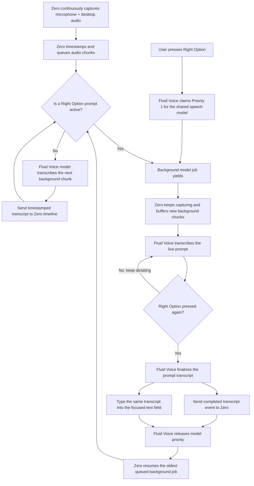

# Zero + Fluid Voice Transcription Architecture

## Status

This is the proposed transcription architecture. Zero already has audio
capture and transcription work in progress, but the Fluid Voice takeover and
transcript handoff described here still need to be implemented.

## Data flow

## What “takeover” means

Fluid Voice takes over use of the shared transcription model, not Zero's
audio capture pipeline. While the prompt is active:

- Zero continues recording microphone and desktop audio.
- Background audio chunks remain safely queued in Zero.
- Fluid Voice uses the speech model for the live prompt so dictation stays
  responsive.
- The second Right Option press finalizes the prompt.
- Fluid Voice sends the completed transcript to Zero and also types it into
  the currently focused application.
- The shared model then returns to Zero's queued background work.

## Required integration contract

Fluid Voice needs to publish a local transcript-completed event or call a
local Zero endpoint with at least:

- transcript text;
- prompt start and end timestamps;
- a stable transcript or prompt identifier;
- source set to `fluid-voice-prompt`;
- finality set to `final`.

Zero should acknowledge receipt, deduplicate by identifier, and place the
prompt transcript on the unified timeline. Audio capture must not depend on
that handoff succeeding; failed deliveries should be retried without losing
the background recording.
