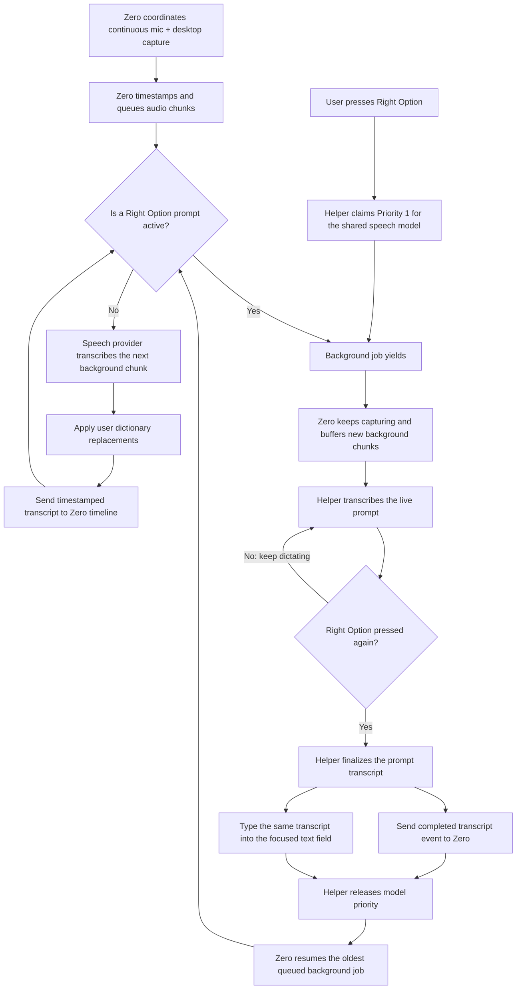

# Zero + Fluid Voice Transcription Architecture

## Status

Zero is the single user-facing app. A bundled native macOS helper
(`source-dictation`) provides FluidVoice-style push-to-dictate inside
`0.app`. There is no second managed application.

Prior design kept FluidVoice as a separate app with a transcript handoff.
That is superseded: the helper is invisible, shares one model with
background transcription, and Right Option transcripts go both to the
focused field and the Zero timeline.

## Data flow

## What “takeover” means

The helper takes over use of the shared transcription model, not Zero's
audio capture pipeline. While the prompt is active:

- Zero continues recording microphone and desktop audio.
- Background audio chunks remain safely queued in Zero.
- The helper uses the speech model for the live prompt so dictation stays
  responsive.
- The second Right Option press finalizes the prompt.
- The helper sends the completed transcript to Zero and also types it into
  the currently focused application.
- The shared model then returns to Zero's queued background work.

## Components

- `src-tauri/src/core/multimodal/speech_provider.rs`: provider-neutral
  contract (`SpeechProvider`, `SpeechTranscript`, `SpeechProviderKind`),
  plus the runtime-agnostic dictionary replacement layer.
- `src/native/source_dictation.swift` + `dictation_core.swift`: bundled
  helper skeleton, built by `src-tauri/build.rs`. Phase 2 adds Right Option
  tap, Core Audio capture, FluidAudio Parakeet, overlay + text insertion.
- Current default provider remains the local Python mlx-audio worker.
  The helper and a localhost sidecar are future providers behind the same
  trait — capture code never calls a worker directly.

## Required integration contract

The helper publishes a transcript-completed event to Zero with at least:

- transcript text (after dictionary replacements);
- prompt start and end timestamps;
- a stable transcript or prompt identifier;
- source set to `fluid-voice-prompt`;
- finality set to `final`.

Zero acknowledges receipt, deduplicates by identifier, and places the
prompt transcript on the unified timeline. Audio capture must not depend on
that handoff succeeding; failed deliveries are retried without losing
the background recording.

## Licensing

FluidVoice is GPLv3. Zero carries a GPLv3 `LICENSE` file for
compatibility with ported concepts. Do not copy FluidVoice source or
distribute a combined build until dependency licenses (FluidAudio,
model weights) are also reviewed.

## Implementation status

Verified end to end on 2026-09-06: the SwiftPM helper (`src-tauri/native-pkg`,
`swift build -c release`) transcribed a synthesized fixture
("Hello world, this is a transcription test.") exactly at 0.989 confidence
via `TRANSCRIBE_FILE` → `TRANSCRIPT`. v3 lives in the shared
`~/Library/Application Support/FluidAudio/` cache — one copy for all apps.

Phase A verified: `tauri build` embeds the 16 MB engine at
`SOURCE.app/Contents/Resources/helpers/source-dictation` (Mach-O arm64,
executable), and that bundled copy transcribes the fixture identically.
`build.rs` prefers the SwiftPM full-engine build with a swiftc stub fallback;
`DictationHelper::helper_path` resolves dev OUT_DIR first, then the bundle
Resources dir. (DMG step fails on this machine — unsigned `bundle_dmg.sh`;
.app itself bundles fine.)

Phase B verified: `setup_app` spawns a supervise loop
(`initialize_dictation_supervisor`) that launches the helper at startup,
feeds its events through `DictationPipeline` with the saved dictionary,
logs transcript actions, and respawns after crashes. Dev log shows
"Dictation helper is ready" with the helper process parented to the app.

- `speech_provider.rs`: provider trait, `LocalMlxProvider`, dictionary
  replacements (tested, incl. longest-match + no re-matching).
- `dictation_helper.rs`: spawn/supervise helper, `START`/`STOP`/`INSERT`,
  parse `READY`/`SESSION_*`/`TRANSCRIPT`/`INSERTED`/`ERROR` (tested).
- `foreground_coordinator.rs`: single-mic priority, background buffering,
  shared Unix-millis clock (tested).
- `dictation_pipeline.rs`: session routing, transcript dedupe by id,
  dictionary before persist, persist-before-insert ordering (tested).
- `speech_model.rs`: v2/v3 catalog, sizes, Polish support flag (tested).
- `bench_wer.rs`: word-error-rate scorer for the v2-vs-v3 shootout (tested).
- `retention.rs`: age + byte-budget eviction, foreground pinning (tested).
- `source_dictation.swift` + `dictation_core.swift`: helper skeleton,
  Right Option toggle (keyCode 61, clean release), session + `TRANSCRIBE_FILE`
  + `INSERT` handling, FluidAudio engine seam (compiles with `swiftc`).
- `focus_capture.swift` + `text_insertion.swift`: focus capture/restore,
  AX selected-range/value insertion → pasteboard → HID fallback,
  synthesized-event tag so the hotkey ignores its own typing (compiles).
- `mic_capture.swift`: per-session 16 kHz mono WAV via AVAudioEngine,
  wired into session start/stop (compiles).
- `dictation_supervisor.rs`: owns helper + pipeline, emits
  persist-then-insert action pairs (tested).
- `Config.custom_dictionary` (Rust + React) with a "My words" settings
  section (`DictionaryControls.tsx`); `tsc` clean.

## Still to build (needs device + permissions)

- Phase 4 remainder: real FluidAudio Parakeet behind `TranscriptionEngine`.
  Scaffold (not yet built — needs network + ~500 MB model download):
  `src-tauri/src-native/dictation/` SwiftPM executable target depending on
  `github.com/FluidInference/FluidAudio` (`fluidaudio-rs` exists if a Rust
  binding is preferred instead), reusing the `TranscriptionEngine` protocol
  shape; `build.rs` then shells out to `swift build -c release` and points
  `SOURCE_DICTATION_HELPER` at the resulting binary.
- Phase 8 remainder: launch at login, menu-bar mode, permission prompts
  (Microphone + Accessibility for the helper binary; event tap degrades
  to stdin control without approval).
- Phase 9: record EN/PL/noisy clips, run both models, score with `bench_wer`.
- Phase 10: signing/notarization so Accessibility approval survives updates.
